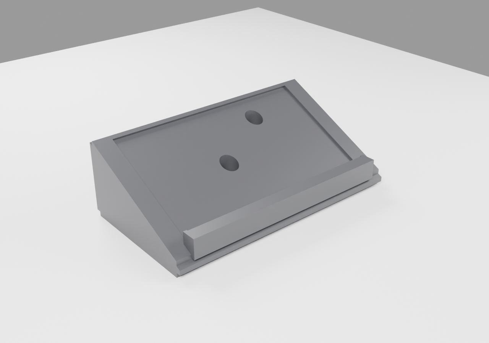

# Base de escritorio para Focusrite Scarlett 2i2 (3ª Gen) — impresión 3D

| Archivo | Uso |
|---|---|
| `base_scarlett_2i2.stl` | Listo para el slicer (Cura, PrusaSlicer, Bambu Studio…). Unidades en mm. |
| `base_scarlett_2i2.blend` | Escena de Blender (incluye un volumen oculto del 2i2, colección `Referencia_2i2`, para comprobar el encaje). |
| `build_stand.py` | Script paramétrico que lo regenera todo: `blender --background --python build_stand.py -- --render` |

**Medidas:** 202 × 110 × 63 mm (anchura interior 178 mm, laterales de 12 mm, altura frontal 12 mm, trasera 65 mm, orificios ø15 mm).
Cabe en camas de 220 × 220 mm (Ender 3, Prusa MK3/MK4, Bambu A1/P1…).

## Ajustes de impresión recomendados
- Orientación: tal cual sale del STL (cara plana grande sobre la cama). **No necesita soportes.**
- Material: PLA o PETG · capa 0,2 mm · 3 perímetros · 4–5 capas superiores/inferiores.
- Relleno: 10–15 % gyroid (la pieza es maciza, el relleno evita gastar material).
- Brim de 5 mm si tu cama tiende a levantar esquinas.

## Después de imprimir
- Pega goma EVA de 2 mm en el rebaje de la rampa.
- Pega 4 patas antideslizantes adhesivas en la base.

## Notas
- El plano marca 15° pero sus cotas (12 → 65 mm en 110 mm) dan ~25,7°; se han respetado las cotas.
  Para cambiarlo edita `FRONT_H` / `REAR_H` al principio del script.
